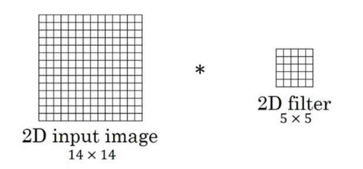

# 【**任务10 -卷积神经网络基础 】时长：2天**

## 1. 卷积

卷积运算的定义、动机（稀疏权重、参数共享、等变表示）。一维卷积运算和二维卷积运算。

通俗易懂的说，就是

**输出 = 输入 \* 系统**

理解卷积

这里提供两个理解卷积的角度：

1. **从函数（或者说映射、变换）的角度理解。** 卷积过程是在图像每个位置进行线性变换映射成新值的过程，将卷积核看成权重，若拉成向量记为ww，图像对应位置的像素拉成向量记为xx，则该位置卷积结果为y=w′x+by=w′x+b，即向量内积+偏置，将xx变换为yy。**从这个角度看，多层卷积是在进行逐层映射，整体构成一个复杂函数，训练过程是在学习每个局部映射所需的权重，训练过程可以看成是函数拟合的过程。**
2. **从模版匹配的角度理解。** 前面我们已经知道，卷积与相关在计算上可以等价，相关运算常用[模板匹配](https://wiki2.org/en/Template_matching)，**即认为卷积核定义了某种模式，卷积（相关）运算是在计算每个位置与该模式的相似程度，或者说每个位置具有该模式的分量有多少，当前位置与该模式越像，响应越强**。下图为图像层面的模板匹配（图片来自[链接](https://docs.opencv.org/2.4/doc/tutorials/imgproc/histograms/template_matching/template_matching.html)），右图为响应图，可见狗头位置的响应最大。当然，也可以在特征层面进行模版匹配，卷积神经网络中的隐藏层即可以看成是在特征层面进行[模板匹配](https://wiki2.org/en/Template_matching)。这时，响应图中每个元素代表的是当前位置与该模式的相似程度，**单看响应图其实看不出什么，可以想像每个位置都有个“狗头”，越亮的地方越像“狗头”**，若给定模板甚至可以通过反卷积的方式将图像复原出来。这里多说一句，**我们真的是想把图像复原出来吗，我们希望的是在图像中找到需要的模式，若是通过一个非线性函数，将响应图中完全不像“狗头”的地方清零，而将像“狗头”的地方保留，然后再将图像复原，发现复原图中只有一个“狗头”，这是不是更美好——因为我们明确了图像中的模式，而减少了其他信息的干扰！**

### 动机

（稀疏权重、参数共享、等变表示）

**局部感知：**（每个神经元只和上一层部分信息相关）（稀疏连接(局部感受)）

（是什么）即网络部分连通，每个神经元只与上一层的部分神经元相连，只感知局部，而不是整幅图像。（滑窗实现）

（可行性）局部像素关系紧密，较远像素相关性弱。

因此只需要局部感知，在更高层将局部的信息综合起来就得到了全局的信息。

受启发于生物视觉系统：局部敏感；对外界认知从局部到全局。

**权值共享：**（相似的信息会存在与各个数据当中，底层的信息是可以共享然后一块提取的）

（是什么）从一个局部区域学习到的信息，应用到图像的其它地方去。即用一个相同的卷积核去卷积整幅图像，相当于对图像做一个全图滤波。一个卷积核对应的特征比如是边缘，那么用该卷积核去对图像做全图滤波，即是将图像各个位置的边缘都滤出来。（帮助实现不变性）。不同的特征靠多个不同的卷积核实现。

（可行性）图像的局部统计特征在整幅图像上具有重复性（即位置无关性）。即如果图像中存在某个基本图形，该基本图形可能出现在任意位置，那么不同位置共享相同权值可实现在数据的不同位置检测相同的模式。比如我们在第一个窗口卷积后得到的特征是边缘，那么这个卷积核对应的就是边缘特征的提取方式，那么我们就可以用这个卷积核去提取其它区域的边缘特征。

### 一维卷积运算和二维卷积运算

## 2. 反卷积(tf.nn.conv2d_transpose)

FCN作者称为backwards convolution，有人称Deconvolution layer is a very unfortunate name and should rather be called a transposed convolutional layer. 我们可以知道，在CNN中有con layer与pool layer，con layer进行对图像卷积提取特征，pool layer对图像缩小一半筛选重要特征，对于经典的图像识别CNN网络，如IMAGENET，最后输出结果是1X1X1000，1000是类别种类，1x1得到的是。FCN作者，或者后来对end to end研究的人员，就是对最终1x1的结果使用反卷积（事实上FCN作者最后的输出不是1X1，是图片大小的32分之一，但不影响反卷积的使用）

目前使用得最多的deconvolution有2种，上文都已经介绍。 
方法1：full卷积， 完整的卷积可以使得原来的定义域变大
方法2：记录pooling index，然后扩大空间，再用卷积填充

图像的deconvolution过程如下，

输入：2x2， 卷积核：4x4， 滑动步长：3， 输出：7x7
即输入为2x2的图片经过4x4的卷积核进行步长为3的反卷积的过程
1.输入图片每个像素进行一次full卷积，根据full卷积大小计算可以知道每个像素的卷积后大小为 1+4-1=4， 即4x4大小的特征图，输入有4个像素所以4个4x4的特征图
2.将4个特征图进行步长为3的fusion（即相加）； 例如红色的特征图仍然是在原来输入位置（左上角），绿色还是在原来的位置（右上角），步长为3是指每隔3个像素进行fusion，重叠部分进行相加，即输出的第1行第4列是由红色特阵图的第一行第四列与绿色特征图的第一行第一列相加得到，其他如此类推。

## 3. 池化运算

pooling 是仿照人的视觉系统进行降维（降采样），用更高层的抽象表示图像特征，这一部分内容从Hubel&wiesel视觉神经研究到Fukushima提出，再到LeCun的LeNet5首次采用并使用BP进行求解，是一条线上的内容，原始推动力其实就是仿生，仿照真正的神经网络构建人工网络。

原因：我们之所以决定使用卷积后的特征是因为图像具有一种“静态性”的属性，这也就意味着在一个图像区域有用的特征极有可能在另一个区域同样适用。因此，为了描述大的图像，一个很自然的想法就是对不同位置的特征进行聚合统计。这个均值或者最大值就是一种聚合统计的方法。
做窗口滑动卷积的时候，卷积值就代表了整个窗口的特征。因为滑动的窗口间有大量重叠区域，出来的卷积值有冗余，进行最大pooling或者平均pooling就是减少冗余。减少冗余的同时，pooling也丢掉了局部位置信息，所以局部有微小形变，结果也是一样的。
**pooling层通常的作用是**:

减少空间大小,减少网络参数,防止过拟合

将卷积层后得到的小邻域内的特征点整合得到新的特征。一方面防止无用参数增加时间复杂度，一方面增加了特征的整合度。

保持某种不变性，包括translation(平移)，rotation(旋转)，scale(尺度),

**最大池化**

前向传播：选图像区域的最大值作为该区域池化后的值。
反向传播：梯度通过最大值的位置传播，其它位置梯度为0。

**平均池化**

前向传播：计算图像区域的平均值作为该区域池化后的值。
反向传播：梯度取均值后分给每个位置。

## 4. Text-CNN的原理。

TextCNN 是利用卷积神经网络对文本进行分类的算法，由 Yoon Kim 在 “Convolutional Neural Networks for Sentence Classification”

TextCNN详细过程：

- **Embedding**：第一层是图中最左边的7乘5的句子矩阵，每行是词向量，维度=5，这个可以类比为图像中的原始像素点。
- **Convolution**：然后经过 kernel_sizes=(2,3,4) 的一维卷积层，每个kernel_size 有两个输出 channel。
- **MaxPolling**：第三层是一个1-max pooling层，这样不同长度句子经过pooling层之后都能变成定长的表示。
- **FullConnection and Softmax**：最后接一层全连接的 softmax 层，输出每个类别的概率。

\5. 利用Text-CNN模型来进行文本分类。

参考自己之前的推荐系统中用到的利用文本卷积网络进行特征提取的部分

https://github.com/watchtree/Recommend/tree/master/2_%E5%8F%AC%E5%9B%9E%E7%AE%97%E6%B3%95_1202

程序见文件夹下CNNtext.ipynb 只做CPU测试，回学校跑GPU