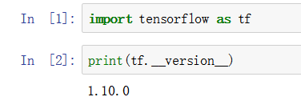

# 【**任务1 -** 前期预备工作】时长：3天

1. Anaconda 安装

实验室远程docker的ssh访问并设定jupyter notebook端口

jupyter notebook --ip=0.0.0.0 --allow-root

211.82.238.123:1006

c7873ffa510ead2f98b9273dab9622361a664af0a7b8396f

1. Conda 学习

会使用conda虚拟环境以及相关库安装方法

1. Python编辑器安装与学习： jupyter notebook  或者 pycharm 

已安装

1. Tensorflow 库安装与学习

可使用

**参考资料 **

1. Anaconda介绍、安装及使用教程(https://zhuanlan.zhihu.com/p/32925500)

1. PyCharm 安装教程（Windows）{http://www.runoob.com/w3cnote/pycharm-windows-install.html}

1. Jupyter Notebook介绍、安装及使用教程{<https://www.jianshu.com/p/91>365f343585}

1. 手把手教你如何安装Tensorflow（Windows和Linux两种版本）{https://blog.csdn.net/Cs_hnu_scw/article/details/79695347}

1. TensorFlow学习笔记1：入门{<http://www.jeyzhang.com/tensorflow-learning-notes.html>}