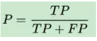

# 【任务2 - 数据集下载探索模块：IMDB数据集（英文）和THUCNews数据集（中文）】时长：2天

## 基本任务

1. 数据集

   数据集：中、英文数据集各一份

   THUCNews中文数据集：[https://pan.baidu.com/s/1hugrfRu](https://pan.baidu.com/s/1hugrfRu#qfud) 密码：qfud

   IMDB英文数据集： [IMDB数据集 Sentiment Analysis](http://ai.stanford.edu/~amaas/data/sentiment/)

   已下载完成

2. IMDB数据集下载和探索模块及指标学习模块

   数据集分为neg,pos两个部分（neg：negative消极的，pos:positive积极的）

   ```python
   # -*- coding: utf-8 -*-
   import os
   import codecs
   pos_location='aclImdb/train/pos'
   pos_files=os.listdir(pos_location)
   neg_location='aclImdb/train/neg'
   neg_files=os.listdir(neg_location)
   pos_all=codecs.open('aclImdb/train/pos_all.txt','a',encoding='utf8')
   neg_all=codecs.open('aclImdb/train/neg_all.txt','a',encoding='utf8')
   all=[]
   for file in pos_files:
       whole_location=os.path.join(pos_location,file)
       with open(whole_location,'r',encoding='utf8') as f:
           line=f.readlines()
           all.extend(line)
   for file in all:
       pos_all.write(file)
       pos_all.write('\n')
   alls=[]
   for file in neg_files:
       whole_location=os.path.join(neg_location,file)
       with open(whole_location,'r',encoding='utf8') as f:
           line=f.readlines()
           alls.extend(line)
   for file in alls:
       neg_all.write(file)
       neg_all.write('\n')
   ```

   读取并将文字部分合并到同一个文件

   ```
   "Story of a man who has unnatural feelings for a pig. Starts out with a opening scene that is a terrific example of absurd comedy. A formal orchestra audience is turned into an insane, violent mob by the crazy chantings of it's singers. Unfortunately it stays absurd the WHOLE time with no general narrative eventually making it just too off putting. Even those from the era should be turned off. The cryptic dialogue would make Shakespeare seem easy to a third grader. On a technical level it's better than you might think with some good cinematography by future great Vilmos Zsigmond. Future stars Sally Kirkland and Frederic Forrest can be seen briefly."
   ```

3. THUCNews数据集下载和探索

   新闻文本形式为其类型属性——对应文本文字

   ```python
   import numpy as np
   with open("cnews/cnews.train.txt", 'r', encoding="utf-8") as file:
       train = file.readlines()
   with open("cnews/cnews.test.txt", 'r', encoding="utf-8") as file:
       test = file.readlines()
       
   import numpy as np
   with open("cnews/cnews.train.txt", 'r', encoding="utf-8") as file:
       train = file.readlines()
   with open("cnews/cnews.test.txt", 'r', encoding="utf-8") as file:
       test = file.readlines()
       
   ```

   训练数据和测试数据各有5000条

   val和vocab文件内数据形式与上述一致

4. 学习召回率、准确率、ROC曲线、AUC、PR曲线这些基本概念

**混淆矩阵**

True Positive(真正，TP)：将正类预测为正类数

True Negative(真负，TN)：将负类预测为负类数

False Positive(假正，FP)：将负类预测为正类数误报 (Type I error)

False Negative(假负，FN)：将正类预测为负类数→漏报 (Type II error)


**准确率(accuracy)**

计算公式为： 


注：准确率是我们最常见的评价指标，而且很容易理解，就是被分对的样本数除以所有的样本数，通常来说，正确率越高，分类器越好。 

分类正确/总样本数

或者也可以定义

正样本分类正确个数/分类为正的个数（预测为正的样本中有多少是真正的正样本）



**召回率（recall）**

理解为我们预测为正的样本有多少是预测正确的

召回率度量有多个正例被分为正例，

样本中的正例有多少被预测正确了


**roc曲线**

1、roc曲线：接收者操作特征(receiveroperating characteristic),roc曲线上每个点反映着对同一信号刺激的感受性。

横轴：负正类率(false postive rate FPR)特异度，划分实例中所有负例占所有负例的比例；(1-Specificity)

纵轴：真正类率(true postive rate TPR)灵敏度，Sensitivity(正类覆盖率)

(1)真正类率(True Postive Rate)TPR: TP/(TP+FN),代表分类器预测的正类中实际正实例占所有正实例的比例。Sensitivity

(2)负正类率(False Postive Rate)FPR: FP/(FP+TN)，代表分类器预测的正类中实际负实例占所有负实例的比例。1-Specificity

(3)真负类率(True Negative Rate)TNR: TN/(FP+TN),代表分类器预测的负类中实际负实例占所有负实例的比例，TNR=1-FPR。Specificity

假设采用逻辑回归分类器，其给出针对每个实例为正类的概率，那么通过设定一个阈值如0.6，概率大于等于0.6的为正类，小于0.6的为负类。对应的就可以算出一组(FPR,TPR),在平面中得到对应坐标点。随着阈值的逐渐减小，越来越多的实例被划分为正类，但是这些正类中同样也掺杂着真正的负实例，即TPR和FPR会同时增大。阈值最大时，对应坐标点为(0,0),阈值最小时，对应坐标点(1,1)。

**AUC：一个正例，一个负例，预测为正的概率值比预测为负的概率值还要大的可能性。**

是ROC曲线下的面积

假设总共有（m+n）个样本，其中正样本m个，负样本n个，总共有m\*n个样本对，计数，正样本预测为正样本的概率值大于负样本预测为正样本的概率值记为1，累加计数，然后除以（m\*n）就是AUC的值

**PR曲线**

指的是Precision Recall曲线，中文为查准率-查全率曲线。PR曲线在分类、检索等领域有着广泛的使用，来表现分类/检索的性能。

如上矩阵图所示：

查准率（Precision Ratio）= TP/P 
查全率（Recall Ratio）= TP/ P'

P-R曲线刻画查准率和查全率之间的关系，查准率指的是在所有预测为正例的数据中，真正例所占的比例，查全率是指预测为真正例的数据占所有正例数据的比例。
 即：查准率P=TP／(TP + FP) 查全率=TP／（TP+FN）
 查准率和查全率是一对矛盾的度量，一般来说，查准率高时，查全率往往偏低，查全率高时，查准率往往偏低，例如，若希望将好瓜尽可能多选出来，则可通过增加选瓜的数量来实现，如果希望将所有的西瓜都选上，那么所有的好瓜必然都被选上了，但这样查准率就会较低；若希望选出的瓜中好瓜比例尽可能高，则可只挑选最有把握的瓜，但这样就难免会漏掉不少好瓜，使得查全率较低。

在很多情况下，我们可以根据学习器的预测结果对样例进行排序，排在前面的是学习器认为最可能是正例的样本，排在后面的是学习器认为最不可能是正例的样本，按此顺序逐个把样本作为正例进行预测，则每次可计算当前的查全率和查准率，以查准率为y轴，以查全率为x轴，可以画出下面的P-R曲线。


查准率-查全率曲线

如果一个学习器的P-R曲线被另一个学习器的P-R曲线完全包住，则可断言后者的性能优于前者，例如上面的A和B优于学习器C，但是A和B的性能无法直接判断，但我们往往仍希望把学习器A和学习器B进行一个比较，我们可以根据曲线下方的面积大小来进行比较，但更常用的是**平衡点**或者是F1值。平衡点（BEP）是查准率=查全率时的取值，如果这个值较大，则说明学习器的性能较好。而F1  =  2 * P * R ／( P + R )，同样，F1值越大，我们可以认为该学习器的性能较好。

参考资料 

1. TensorFlow官方教程：影评文本分类  |  TensorFlow (https://tensorflow.google.cn/tutorials/keras/basic_text_classification)

2. 科赛 - Kesci.com (https://www.kesci.com/home/project/5b6c05409889570010ccce90

3. 博客中的数据集部分和预处理部分：CNN字符级中文文本分类-基于TensorFlow实现 - 一蓑烟雨 - CSDN博客 (https://blog.csdn.net/u011439796/article/details/77692621)

4. text-classification-cnn-rnn/cnews_loader.py at mas...(https://github.com/gaussic/text-classification-cnn-rnn/blob/master/data/cnews_loader.py)
5. 机器学习之类别不平衡问题 (2) —— ROC和PR曲线_慕课手记(https://www.imooc.com/article/48072)