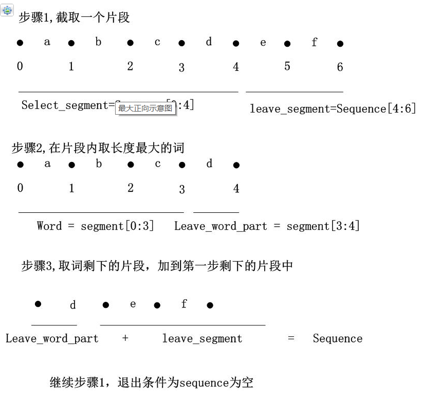

# 【任务3 - 特征提取】时长：2天

## 1. 基本文本处理技能

  1.1 分词的概念（分词的正向最大、逆向最大、双向最大匹配法）；

​	词是最小的能够独立活动的有意义的语言成分，英文单词之间是以空格作为自然分界符的，而汉语是以字为基本的书写单位，词语之间没有明显的区分标记，因此，中文词语分析是中文分词的基础与关键。

​	中文和英文都存在分词的需求，不过相较而言，英文单词本来就有空格进行分割，所以处理起来相对方便。但是，由于中文是没有分隔符的，所以分词的问题就比较重要。

​	分词常用的手段是基于字典的最长串匹配，据说可以解决85%的问题，但是歧义分词很难。举个例子，“美国会通过对台售武法案”，我们既可以切分为“美国/会/通过对台售武法案”，又可以切分成“美/国会/通过对台售武法案”。

分词算法设计中的几个基本原则：

1、颗粒度越大越好：用于进行语义分析的文本分词，要求分词结果的颗粒度越大，即单词的字数越多，所能表示的含义越确切，如：“公安局长”可以分为“公安 局长”、“公安局 长”、“公安局长”都算对，但是要用于语义分析，则“公安局长”的分词结果最好（当然前提是所使用的词典中有这个词）

2、切分结果中非词典词越少越好，单字字典词数越少越好，这里的“非词典词”就是不包含在词典中的单字，而“单字字典词”指的是可以独立运用的单字，如“的”、“了”、“和”、“你”、“我”、“他”。例如：“技术和服务”，可以分为“技术 和服 务”以及“技术 和 服务”，但“务”字无法独立成词（即词典中没有），但“和”字可以单独成词（词典中要包含），因此“技术 和服 务”有1个非词典词，而“技术 和 服务”有0个非词典词，因此选用后者。

3、总体词数越少越好，在相同字数的情况下，总词数越少，说明语义单元越少，那么相对的单个语义单元的权重会越大，因此准确性会越高。

基于字典

正向最大分词

如果叫成最长正向分词要更形象一些，是一种分治+贪婪的思想，并不一时处理全部串，而是分别处理预先设立长度的每一段，在每一段中求取最长的并且出现在字典里面的词。例如：abcdefabcdef，预先设立的最大长度为3。所以，先从串的开始截取长度为三的子串，即abcabc，如果abcabc出现在字典中，那么abcabc将作为分词结果，接着以相同方式处理defdef；如果abcabc没出现在字典里面，则从右边减少一个字符，再次匹配字典，即abab匹配，减少的字符将加入之前未选择的字符集里面作下一次匹配，这里是cdefcdef，如果一个串没匹配到长度大于1的字典词，则返回最左边的字符作为该串的分词结果，也就是abab如果没有匹配到，无论aa是否在字典中，都将作为分词结果



逆向最大分词

有了正向最大分词，逆向就很好理解了，正向是从前向后选取最大长度的串，然后从选取串的尾部向前匹配字典词，删除右边的字符。逆向最大便是从后向前选取最大长度的串，从选取串开始向后匹配字典词，而删减的也便是左边的字符。

双向最大分词

双向就是结合正向最大和逆向最大的结果，对两个结果进行比较，从而决定正确的分词方式，当前向和逆向分词数量不相等的时候，选择数量较少的那个分词结果。如果分词数量相同，则依次比较分词结果，相应位置如果分词相同，则选取为最后的结果中，如果相应位置分词结果不一样则选取字符较少的那个最为分词结果。

  1.2 词、字符频率统计；（可以使用Python中的collections.Counter模块，也可以自己寻找其他好用的库）

```python
lists = []
for i in x_train_data:
    i_list = list(i)
    [i_list.remove(item) for item in i_list if item in '，。！”“']
    lists.extend(i_list)
dic = dict(collections.Counter(lists))
def sort_by_count(d):
    #字典排序
    d = collections.OrderedDict(sorted(d.items(), key = lambda t: -t[1]))
    return d
sortedDic = sort_by_count(dic)
```


## 2. 语言分析

  2.1 语言模型中unigram、bigram、trigram的概念；

  2.2 unigram、bigram频率统计；（可以使用Python中的collections.Counter模块，也可以自己寻找其他好用的库）

unigram 一元分词，把句子分成一个一个的汉字

bigram 二元分词，把句子从头到尾每两个字组成一个词语

```python
lists = []

for i in x_train_data:
    i_list = list(i)
    [i_list.remove(item) for item in i_list if item in '，。！”“']
    
    for j in range(len(i_list)//2):
        lists.append(i_list[2*j]+i_list[2*j+1])
```


trigram 三元分词，把句子从头到尾每三个字组成一个词语.

```python
lists = []
for i in x_train_data:
    i_list = list(i)
    [i_list.remove(item) for item in i_list if item in '，。！”“']
    
    for j in range(len(i_list)//3):
        lists.append(i_list[3*j]+i_list[3*j+1]+i_list[3*j+2])
```


## 3. 文本矩阵化：要求采用词袋模型且是词级别的矩阵化

步骤有：

  3.1 分词（可采用结巴分词来进行分词操作，其他库也可以）；

```python
seg_list = jieba.cut("我来到北京清华大学")
print([i for i in seg_list])
['我', '来到', '北京', '清华大学']
```

  3.2 去停用词；构造词表。

```python
#去停用词
lists = []
count = 0
for i in x_train_data:
    word_list = [word for word in jieba.cut(i) if word not in stopwords]
    lists.append(word_list)
    
#取前100条数据加快处理
data = lists[:100]
#统计词表出现次数
wordList = {}
for i in data:
    for j in i:
        if j in wordList:
            wordList[j] += 1
        else:
            wordList[j] = 1
#创建词表
count = 0
dic = {}
for i, j in wordList.items():
    if j > 2:
        dic[i] = count 
        count += 1
#反向词表
resDic = {}
for i, j in dic.items():
    resDic[j] = i
```

  3.3 每篇文档的向量化。

```python
UNK = 0
for i in range(len(data)):
    data[i] = [dic[j] if j in dic else UNK for j in data[i]]
```

将未出现过的单词的位置填充为0

参考资料 

1. 结巴分词介绍和使用：GitHub - fxsjy/jieba: 结巴中文分词(https://github.com/fxsjy/jieba)