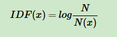
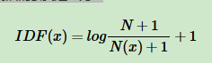
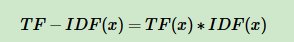
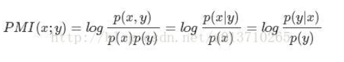
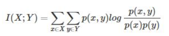

# 【**任务4 -文本表示】时长：2天**


## 1. TF-IDF原理

文本的分词之后进行文本分类聚类

词袋模型(Bag of Words,简称BoW)。词袋模型假设我们不考虑文本中词与词之间的上下文关系，仅仅只考虑所有词的权重。而权重与词在文本中出现的频率有关。

词袋模型首先会进行分词，在分词之后，通过统计每个词在文本中出现的次数，我们就可以得到该文本基于词的特征，如果将各个文本样本的这些词与对应的词频放在一起，就是我们常说的向量化。

```python
from sklearn.feature_extraction.text import CountVectorizer  
vectorizer=CountVectorizer()  # 文本特征提取类
corpus=["I come to China to travel", 
    "This is a car polupar in China",          
    "I love tea and Apple ",   
    "The work is to write some papers in science"] 
vec_fit = vectorizer.fit_transform(corpus) #对于corpus训练样本，生成对应的类

# 获取列表形式文本
print(vectorizer.get_feature_names())  
#['and', 'apple', 'car', 'china', 'come', 'in', 'is', 'love', 'papers', 'polupar', 'science', 'some', 'tea', 'the', 'this', 'to', 'travel', 'work', 'write']

# 打印字典
print(vectorizer.vocabulary_)   
#{'come': 4, 'to': 15, 'china': 3, 'travel': 16, 'this': 14, 'is': 6, 'car': 2, 'polupar': 9, 'in': 5, 'love': 7, 'tea': 12, 'and': 0, 'apple': 1, 'the': 13, 'work': 17, 'write': 18, 'some': 11, 'papers': 8, 'science': 10}

print(vec_fit)
# 第0个列表元素，**词典中索引为3的元素**， 词频
  (0, 16)	1
  (0, 3)	1
  (0, 15)	2
  (0, 4)	1
  (1, 5)	1
  (1, 9)	1
  (1, 2)	1
  (1, 6)	1
  (1, 14)	1
  (1, 3)	1
  (2, 1)	1
  (2, 0)	1
  (2, 12)	1
  (2, 7)	1
  (3, 10)	1
  (3, 8)	1
  (3, 11)	1
  (3, 18)	1
  (3, 17)	1
  (3, 13)	1
  (3, 5)	1
  (3, 6)	1
  (3, 15)	1
    
print(vec_fit.toarray()) #.toarray() 是将结果转化为稀疏矩阵矩阵的表示方式；
# 下面是一个字典
# 第一句话的 词 分别的位置和出现的字数
# 稀疏矩阵表示方式
# 第一句话可以用第一个向量表示，不能表示出顺序关系，只能看出存在
[[0 0 0 1 1 0 0 0 0 0 0 0 0 0 0 2 1 0 0]
 [0 0 1 1 0 1 1 0 0 1 0 0 0 0 1 0 0 0 0]
 [1 1 0 0 0 0 0 1 0 0 0 0 1 0 0 0 0 0 0]
 [0 0 0 0 0 1 1 0 1 0 1 1 0 1 0 1 0 1 1]]

#每个词在所有文档中的词频，统计每一词出现的次数
print(vec_fit.toarray().sum(axis=0))  
[1 1 1 2 1 2 2 1 1 1 1 1 1 1 1 3 1 1 1]
```


统计词频

向量化完毕后一般也会使用TF-IDF进行特征的权重修正，再将特征进行标准化。 再进行一些其他的特征工程后，就可以将数据带入机器学习算法进行分类聚类了。

在文本的向量化之后进行TF-IDF

原因：

```
corpus=["I come to China to travel", 
    "This is a car polupar in China",          
    "I love tea and Apple ",   
    "The work is to write some papers in science"] 
```

　　　　不考虑停用词，处理后得到的词向量如下：

```python
[[0 0 0 1 1 0 0 0 0 0 0 0 0 0 0 2 1 0 0]
 [0 0 1 1 0 1 1 0 0 1 0 0 0 0 1 0 0 0 0]
 [1 1 0 0 0 0 0 1 0 0 0 0 1 0 0 0 0 0 0]
 [0 0 0 0 0 1 1 0 1 0 1 1 0 1 0 1 0 1 1]]
```

​	4个文本都是19维的特征向量。而每一维的向量依次对应了下面的19个词。另外由于词"I"在英文中是停用词，不参加词频的统计。

　 由于大部分的文本都只会使用词汇表中的很少一部分的词，因此我们的词向量中会有大量的0。也就是说词向量是稀疏的。在实际应用中一般使用稀疏矩阵来存储。

​	因为特征过于稀疏，所以进行TF-IDF进行词特征值修订

​	如果我们直接将统计词频后的19维特征做为文本分类的输入，会发现有一些问题。比如第一个文本，我们发现"come","China"和“Travel”各出现1次，而“to“出现了两次。似乎看起来这个文本与”to“这个特征更关系紧密。但是实际上”to“是一个非常普遍的词，几乎所有的文本都会用到，因此虽然它的词频为2，但是重要性却比词频为1的"China"和“Travel”要低的多。如果我们的向量化特征仅仅用词频表示就无法反应这一点。因此我们需要进一步的预处理来反应文本的这个特征，而这个预处理就是TF-IDF。

前面的TF也就是我们前面说到的词频，我们之前做的向量化也就是做了文本中各个词的出现频率统计，并作为文本特征

IDF，即“逆文本频率”如何理解。在上一节中，我们讲到几乎所有文本都会出现的"to"其词频虽然高，但是重要性却应该比词频低的"China"和“Travel”要低。我们的IDF就是来帮助我们来反应这个词的重要性的，进而修正仅仅用词频表示的词特征值。

那么如何对一个词的IDF进行定量分析呢？这里直接给出一个词xx的IDF的基本公式如下：



其中，N代表语料库中文本的总数，而N(x)代表语料库中包含词x的文本总数。

即词x在文本中出现的频率

常用的IDF我们需要做一些平滑，使语料库中没有出现的词也可以得到一个合适的IDF值。平滑的方法有很多种，最常见的IDF平滑后的公式之一为：



修正：放置生僻词在语料库中没有出现

有了IDF的定义，我们就可以计算某一个词的TF-IDF值了：



TF(x)指词x在当前文本中的词频，指不用TF-IDF的特征向量

IDF对其进行修正，降低出现次数过多的单词的特征值

  TF-IDF（Term Frequency–Inverse Document Frequency）是一种用于资讯检索与文本挖掘的常用加权技术。TF-IDF是一种统计方法，用以评估一个字词对于一个文件集或一个语料库中的其中一份文件的重要程度。字词的重要性随着它在文件中出现的次数成正比增加，但同时会随着它在语料库中出现的频率成反比下降。TF-IDF加权的各种形式常被搜索引擎应用，作为文件与用户查询之间相关程度的度量或评级。

TF-IDF的主要思想是：如果某个词或短语在一篇文章中出现的频率TF高，并且在其他文章中很少出现，则认为此词或者短语具有很好的类别区分能力，适合用来分类。

## 2. 文本矩阵化

使用词袋模型，以TF-IDF特征值为权重。（可以使用Python中TfidfTransformer库）

```
from sklearn.feature_extraction.text import TfidfTransformer 
from sklearn.feature_extraction.text import CountVectorizer 
 
corpus=["I come to China to travel", 
    "This is a car polupar in China",          
    "I love tea and Apple ",   
    "The work is to write some papers in science"] 
    
# 调用文本向量化 的类
vectorizer=CountVectorizer()
print(vectorizer.fit_transform(corpus))

transformer = TfidfTransformer()
tfidf = transformer.fit_transform(vectorizer.fit_transform(corpus)) 
# 输出的各个文本各个词的 TF-IDF 值
print (tfidf)
 (0, 16)	0.4424621378947393
  (0, 15)	0.697684463383976
  (0, 4)	0.4424621378947393
  (0, 3)	0.348842231691988
  (1, 14)	0.45338639737285463
  (1, 9)	0.45338639737285463
  (1, 6)	0.3574550433419527
  (1, 5)	0.3574550433419527
  (1, 3)	0.3574550433419527
  (1, 2)	0.45338639737285463
  (2, 12)	0.5
  (2, 7)	0.5
  (2, 1)	0.5
  (2, 0)	0.5
  (3, 18)	0.3565798233381452
  (3, 17)	0.3565798233381452
  (3, 15)	0.2811316284405006
  (3, 13)	0.3565798233381452
  (3, 11)	0.3565798233381452
  (3, 10)	0.3565798233381452
  (3, 8)	0.3565798233381452
  (3, 6)	0.2811316284405006
  (3, 5)	0.2811316284405006
print(tfidf.toarray()) #.toarray() 是将结果转化为稀疏矩阵矩阵的表示方式
[[0.         0.         0.         0.34884223 0.44246214 0.
  0.         0.         0.         0.         0.         0.
  0.         0.         0.         0.69768446 0.44246214 0.
  0.        ]
 [0.         0.         0.4533864  0.35745504 0.         0.35745504
  0.35745504 0.         0.         0.4533864  0.         0.
  0.         0.         0.4533864  0.         0.         0.
  0.        ]
 [0.5        0.5        0.         0.         0.         0.
  0.         0.5        0.         0.         0.         0.
  0.5        0.         0.         0.         0.         0.
  0.        ]
 [0.         0.         0.         0.         0.         0.28113163
  0.28113163 0.         0.35657982 0.         0.35657982 0.35657982
  0.         0.35657982 0.         0.28113163 0.         0.35657982
  0.35657982]]

```


## 3. 互信息的原理

机器学习相关文献里面，经常会用到点互信息PMI(Pointwise Mutual Information)这个指标来衡量两个事物之间的相关性（比如两个词）



* 如果x跟y不相关，则p(x,y)=p(x)p(y)。二者相关性越大，则p(x, y)就相比于p(x)p(y)越大。

* 在y出现的情况下x出现的条件概率p(x|y)除以x本身出现的概率p(x)，自然就表示x跟y的相关程度。

举个自然语言处理中的例子来说，我们想衡量like这个词的极性（正向情感还是负向情感）。我们可以预先挑选一些正向情感的词，

比如good。然后我们算like跟good的PMI

点互信息PMI其实就是从信息论里面的互信息这个概念里面衍生出来的。  

互信息即



## 4. 使用第二步生成的特征矩阵，利用互信息进行特征筛选。

特征选择

“无关特征”（irrelevant feature）。比如，通过空气的湿度，环境的温度，风力和当地人的男女比例来预测明天会不会下雨，其中男女比例就是典型的无关特征。

要减少的另一类特征叫做“多余特征”（redundant feature）

**过滤（Filter）**

**包裹（Warpper）**

**嵌入法（Embedding）**

sklearn.metrics.mutual_info_score：


```python
from sklearn import metrics as mr
mr.mutual_info_score(data[0],data[1])
```


参考资料 

1. 文本挖掘预处理之TF-IDF：文本挖掘预处理之TF-IDF - 刘建平Pinard - 博客园 (https://www.cnblogs.com/pinard/p/6693230.html)

1. 使用不同的方法计算TF-IDF值：使用不同的方法计算TF-IDF值 - 简书(https://www.jianshu.com/p/f3b92124cd2b)

1. sklearn-点互信息和互信息：sklearn：点互信息和互信息 - 专注计算机体系结构 - CSDN博客 (https://blog.csdn.net/u013710265/article/details/72848755)

1. 如何进行特征选择（理论篇）机器学习你会遇到的“坑”：如何进行特征选择（理论篇）机器学习你会遇到的“坑” (https://baijiahao.baidu.com/s?id=1604074325918456186&wfr=spider&for=pc)