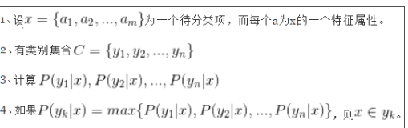
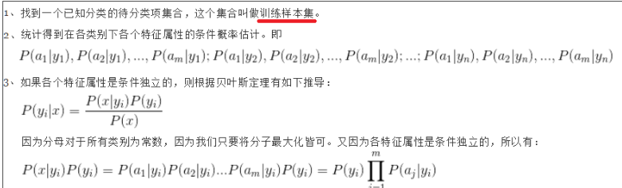
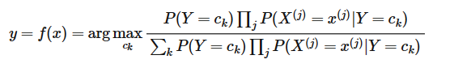
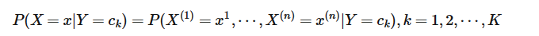
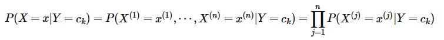
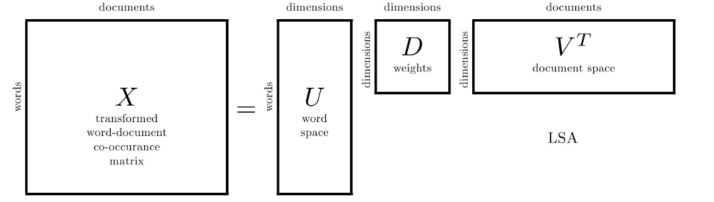

# 【**任务5 -传统机器学习--朴素贝叶斯 】时长：2天**

\1. 朴素贝叶斯的原理

\2. 朴素贝叶斯应用场景 

\3. 朴素贝叶斯优缺点 

\4. 朴素贝叶斯 sklearn 参数学习 

\5. 利用朴素贝叶斯模型结合 Tf-idf 算法进行文本分类

## 1. 朴素贝叶斯的原理

复习以前学习的内容《统计学习方法》

优点：在数据较少的情况下依然有效，可以处理多类别问题

缺点：对于输入数据的准备方式较为敏感

适用数据类型：标称性数据

**买瓜问题** 介绍先验概率和后验概率

最近天气炎热，来到超市准备买个西瓜，可是没有太多的经验，不知道怎么样才能挑个熟瓜。这时候，作为理科生，就有这样的考虑：

如果我对这个西瓜没有任何了解，包括瓜的颜色、形状、瓜蒂是否脱落。按常理来说，西瓜成熟的概率大概是 60%。那么，这个概率 P(瓜熟) 就被称为**先验概率**。

也就是说，先验概率是**根据以往经验和分析得到的概率，先验概率无需样本数据，不受任何条件的影响**。就像红色石头只根据常识而不根据西瓜状态来判断西瓜是否成熟，这就是先验概率。

再来看，红色石头以前学到了一个判断西瓜是否成熟的常识，就是看瓜蒂是否脱落。一般来说，瓜蒂脱落的情况下，西瓜成熟的概率大一些，大概是 75%。如果把瓜蒂脱落当作一种结果，然后去推测西瓜成熟的概率，这个概率 P(瓜熟 | 瓜蒂脱落) 就被称为**后验概率**。后验概率**类似于条件概率**。

朴素贝叶斯分类是一种十分简单的分类算法，叫它朴素贝叶斯分类是因为这种方法的思想真的很朴素，朴素贝叶斯的思想基础是这样的：对于给出的待分类项，求解在此项出现的条件下各个类别出现的概率，哪个最大，就认为此待分类项属于哪个类别。通俗来说，就好比这么个道理，你在街上看到一个黑人，我问你你猜这哥们哪里来的，你十有八九猜非洲。为什么呢？因为黑人中非洲人的比率最高，当然人家也可能是美洲人或亚洲人，但在没有其它可用信息下，我们会选择条件概率最大的类别，这就是朴素贝叶斯的思想基础。

最大化在输入为x的情况下，输出分类1~k的概率，取最大的概率

即为一种条件概率

条件概率的计算

统计学习方法：朴素贝叶斯分类器：

计算Y=C_k的概率用训练样本集中第k个出现的次数代替

计算当Y=C_k时，X_j = x_j的概率为所有Y=C_k的样本中，X_j = x_j的样本的数量/所有Y=C_k的样本

其中连乘符号来源于条件独立性检验

分母相同，所以需要最大化概率分子

**条件独立性假设**

当Y当Y=C_k时，X为特定样本（每一个属性都具有特定特征）的概率

因此条件独立，转化为特定样本对应特定属性

## 2. 朴素贝叶斯优缺点 /应用场景

优点：

1）朴素贝叶斯模型发源于古典数学理论，有稳定的分类效率。

2）对小规模的数据表现很好，能个处理多分类任务，适合增量式训练，尤其是数据量超出内存时，我们可以一批批的去增量训练。

3）对缺失数据不太敏感，算法也比较简单，常用于文本分类。

缺点：

1） 理论上，朴素贝叶斯模型与其他分类方法相比具有最小的误差率。但是实际上并非总是如此，这是因为朴素贝叶斯模型假设属性之间相互独立，这个假设在实际应用中往往是不成立的，在属性个数比较多或者属性之间相关性较大时，分类效果不好。而在属性相关性较小时，朴素贝叶斯性能最为良好。对于这一点，有半朴素贝叶斯之类的算法通过考虑部分关联性适度改进。

2）需要知道先验概率，且先验概率很多时候取决于假设，假设的模型可以有很多种，因此在某些时候会由于假设的先验模型的原因导致预测效果不佳。

3）由于我们是通过先验和数据来决定后验的概率从而决定分类，所以分类决策存在一定的错误率。

4）对输入数据的表达形式很敏感。

适用数据类型：标称性数据

典型的例子是Naive Bayes，核心思路是根据条件概率计算待判断点的类型。

是相对容易理解的一个模型，至今依然被垃圾邮件过滤器使用。

适用情景：

需要一个比较容易解释，而且不同维度之间相关性较小的模型的时候。

可以高效处理高维数据，虽然结果可能不尽如人意

朴素贝叶斯的独立性假设要求样本样本不同维度之间相关性需要较小。

## 3. 利用朴素贝叶斯模型进行文本分类

复习之前不用sklearn库的贝叶斯分类代码

https://github.com/watchtree/ML_in_action/blob/master/week3bayes/bayes.ipynb

利用sklearn分类库进行之间下载数据的分类

见当前文件夹下Bayes+SVM.ipynb

取1000条训练，100条测试

训练集正确率0.995，测试集正确率0.86

## 4. 朴素贝叶斯 sklearn 参数学习 

**alpha** : float, optional (default=1.0)Additive (Laplace/Lidstone) smoothing parameter (0 for no smoothing).平滑处理，防止分母为0

**fit_prior** : boolean, optional (default=True)Whether to learn class prior probabilities or not. If false, a uniform prior will be used.是否学习先验概率（先验概率是通过样本数量计算还是提前设定）

**class_prior** : array-like, size (n_classes,), optional (default=None)Prior probabilities of the classes. If specified the priors are not adjusted according to the data.先验概率数组

**alpha=1**——训练集0.992——测试集0.83

**alpha=0.95**——训练集0.993——测试集0.83

**alpha=0.9**——训练集0.996——测试集0.84

**alpha=0.7**——训练集0.996——测试集0.84

**alpha=0.5**——训练集0.997——测试集0.85

**alpha=0.2**——训练集0.999——测试集0.85

**alpha=0.1**——训练集0.999——测试集0.87

## 5. 利用朴素贝叶斯模型结合 Tf-idf 算法进行文本分类

见当前文件夹下Bayes+SVM.ipynb

alpha=0.1——训练集0.992——测试集0.89

# 后续需要补充

## 3. SVM的原理

《统计学习方法》SVM推导

给定训练样本，支持向量机建立一个超平面作为决策曲面，使得正例和反例的隔离边界最大化。

凸优化问题最大化

## 4. 利用SVM模型进行文本分类

见当前文件夹下Bayes+SVM.ipynb

训练集正确率0.999，测试集正确率0.85

## 9. pLSA、共轭先验分布；LDA主题模型原理

参考：https://www.cnblogs.com/bentuwuying/p/6219970.html

SA(latent semantic analysis)潜在语义分析，也被称为 LSI(latent semantic index)，是 Scott Deerwester, Susan T. Dumais 等人在 1990 年提出来的一种新的**索引和检索**方法。该方法和传统向量空间模型(vector space model)一样使用向量来表示词(terms)和文档(documents)，并通过向量间的关系(如夹角)来判断词及文档间的关系；不同的是，LSA 将词和文档映射到**潜在语义空间**，从而去除了原始向量空间中的一些“噪音”，提高了信息检索的精确度。

第一个矩阵 U 中的每一行表示意思相关的一类词，其中的每个非零元素表示这类词中每个词的重要性（或者说相关性），数值越大越相关。（单词）

中间的矩阵 D 则表示类词和文章类之间的相关性。（单词与主题）

最后一个矩阵 V 中的每一列表示同一主题一类文章，其中每个元素表示这类文章中每篇文章的相关性。

\10. 使用LDA生成主题特征，在之前特征的基础上加入主题特征进行文本分类

参考资料 

1. 朴素贝叶斯1：sklearn：朴素贝叶斯（naïve beyes） - 专注计算机体系结构 - CSDN博客 (https://blog.csdn.net/u013710265/article/details/72780520)

1. 文本分类算法之决策树学习(https://blog.csdn.net/liuyongkanglinux/article/details/8253605)

1. 决策树（CART算法）针对中文文本分类(https://blog.csdn.net/appleyuchi/article/details/79057242)

1. 从决策树到随机森林：树型算法的原理与实现(https://www.jiqizhixin.com/articles/2017-07-31-3)

1. 用LDA处理文本(Python) - 专注计算机体系结构 - CSDN博客 (https://blog.csdn.net/u013710265/article/details/73480332)

1. 合并特征：Python：合并两个numpy矩阵 - 专注计算机体系结构 - CSDN博客(https://blog.csdn.net/u013710265/article/details/72848564)

往期优秀作业学习

1.ckh  

<https://blog.csdn.net/chen_yiwei/article/details/88354971>

<https://blog.csdn.net/chen_yiwei/article/details/88357856>

<https://blog.csdn.net/chen_yiwei/article/details/88370526>

2.尤园 <https://blog.csdn.net/yyy430/article/details/88346920>

3.流量的星星  <http://note.youdao.com/noteshare?id=c336d1f8295598b11b79a1ecff908419&sub=D992007A9F924A2784FDC0ED46888558>