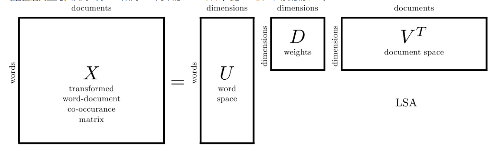
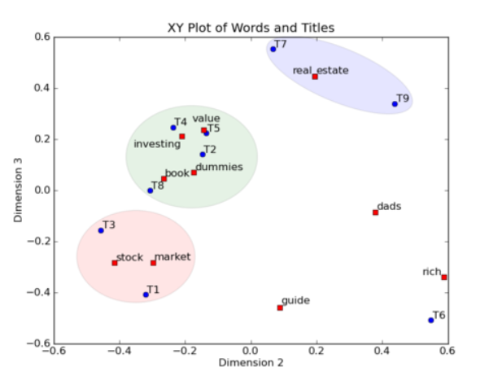
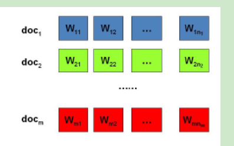
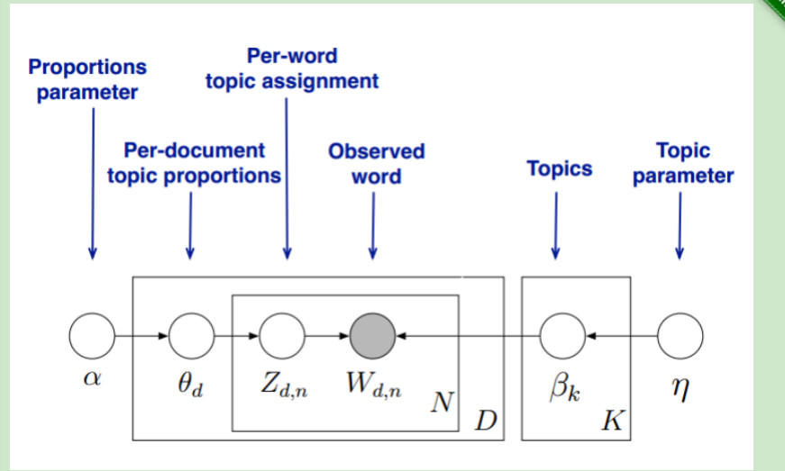

# 【任务7 -传统机器学习--**LDA **】时长：2天

## 1. pLSA、共轭先验分布；LDA主题模型原理

参考：https://www.cnblogs.com/bentuwuying/p/6219970.html

LSA(latent semantic analysis)潜在语义分析，也被称为 LSI(latent semantic index)，是 Scott Deerwester, Susan T. Dumais 等人在 1990 年提出来的一种新的**索引和检索**方法。该方法和传统向量空间模型(vector space model)一样使用向量来表示词(terms)和文档(documents)，并通过向量间的关系(如夹角)来判断词及文档间的关系；不同的是，LSA 将词和文档映射到**潜在语义空间**，从而去除了原始向量空间中的一些“噪音”，提高了信息检索的精确度。

第一个矩阵 U 中的每一行表示意思相关的一类词，其中的每个非零元素表示这类词中每个词的重要性（或者说相关性），数值越大越相关。（单词）

中间的矩阵 D 则表示类词和文章类之间的相关性。（单词与主题）

最后一个矩阵 V 中的每一列表示同一主题一类文章，其中每个元素表示这类文章中每篇文章的相关性。

传统向量空间模型使用精确的词匹配，即精确匹配用户输入的词与向量空间中存在的词，无法解决**一词多义**(polysemy)和**一义多词**(synonymy)的问题。实际上在搜索中，我们实际想要去比较的不是词，而是**隐藏在词之后的意义和概念**。

LSA 的核心思想是将词和文档映射到**潜在语义空间**，再比较其相似性。

在图上，每一个红色的点，都表示一个词，每一个蓝色的点，都表示一篇文档，这样我们可以对这些词和文档进行聚类，比如说 stock 和 market 可以放在一类，因为他们老是出现在一起，real 和 estate 可以放在一类，dads，guide 这种词就看起来有点孤立了，我们就不对他们进行合并了。按这样聚类出现的效果，可以提取文档集合中的近义词，这样当用户检索文档的时候，是用语义级别（近义词集合）去检索了，而不是之前的词的级别。这样一减少我们的检索、存储量，因为这样压缩的文档集合和PCA是异曲同工的，二可以提高我们的用户体验，用户输入一个词，我们可以在这个词的近义词的集合中去找，这是传统的索引无法做到的。

**LSA的优点**

1）低维空间表示可以刻画同义词，同义词会对应着相同或相似的主题。

2）降维可去除部分噪声，是特征更鲁棒。

3）充分利用冗余数据。

4）无监督/完全自动化。

5）与语言无关。

**3. LSA的缺点**

1）LSA可以处理向量空间模型无法解决的一义多词(synonymy)问题，但不能解决**一词多义**(polysemy)问题。因为LSA将每一个词映射为潜在语义空间中的一个点，也就是说一个词的多个意思在空间中对于的是同一个点，并没有被区分。

2）SVD的优化目标基于L-2 norm 或者 Frobenius Norm 的，这相当于隐含了对数据的高斯分布假设。而 term 出现的次数是非负的，这明显不符合 Gaussian 假设，而更接近 Multi-nomial 分布。

3）特征向量的方向没有对应的物理解释。

4）SVD的计算复杂度很高，而且当有新的文档来到时，若要更新模型需重新训练。

5）没有刻画term出现次数的概率模型。

6）对于count vectors 而言，欧式距离表达是不合适的（重建时会产生负数）。

7）维数的选择是ad-hoc的。

**pLSA**

首先，我们1可以看看日常生活中人是如何构思文章的。如果我们要写一篇文章，往往是先确定要写哪几个主题。譬如构思一篇自然语言处理相关的文章，可能40%会谈论语言学，30%谈论概率统计，20%谈论计算机，还有10%谈论其它主题。

对于语言学，容易想到的词包括：语法，句子，主语等；对于概率统计，容易想到的词包括：概率，模型，均值等；对于计算机，容易想到的词包括：内存，硬盘，编程等。我们之所以能想到这些词，是因为这些词在对应的主题下出现的概率很高。我们可以很自然的看到，一篇文章通常是由多个主题构成的，而每一个主题大概可以用与该主题相关的频率最高的一些词来描述。以上这种想法由Hofmann于1999年给出的pLSA模型中首先进行了明确的数学化。Hofmann认为一篇文章（Doc）可以由多个主题（Topic）混合而成，而每个Topic都是词汇上的概率分布，文章中的每个词都是由一个固定的Topic生成的。下图是英语中几个Topic的例子。

使用EM算法求解pLSA的基本实现方法：

(1)E步骤：求隐含变量Given当前估计的参数条件下的后验概率。

(2)M步骤：最大化**Complete data对数似然函数**的期望，此时我们使用E步骤里计算的隐含变量的后验概率，得到新的参数值。

两步迭代进行直到收敛。

**3. pLSA的优势**

1）定义了概率模型，而且每个变量以及相应的概率分布和条件概率分布都有明确的物理解释。

2）相比于LSA隐含了高斯分布假设，pLSA隐含的Multi-nomial分布假设更符合文本特性。

3）pLSA的优化目标是是KL-divergence最小，而不是依赖于最小均方误差等准则。

4）可以利用各种model selection和complexity control准则来确定topic的维数。

**4. pLSA的不足**

1）概率模型不够完备：在document层面上没有提供合适的概率模型，使得pLSA并不是完备的生成式模型，而必须在确定document i的情况下才能对模型进行随机抽样。

2）随着document和term 个数的增加，pLSA模型也线性增加，变得越来越庞大。

3）EM算法需要反复的迭代，需要很大计算量。

针对pLSA的不足，研究者们又提出了各种各样的topic based model, 其中包括大名鼎鼎的Latent Dirichlet Allocation (LDA)。

**共轭先验分布**

**共轭分布(conjugacy)**：后验概率分布函数与先验概率分布函数具有相同形式

可以使得先验分布和后验分布的形式相同，这样一方面合符人的直观（它们应该是相同形式的）另外一方面是可以形成一个先验链，即现在的后验分布可以作为下一次计算的先验分布，如果形式相同，就可以形成一个链条。

如果先验分布和似然函数可以使得先验分布和后验分布（posterior distributions）有相同的形式，那么就称先验分布与似然函数**是共轭的。**所以，共轭是指的先验分布(prior probability distribution)和似然函数(likelihood function)。如果某个随机变量Θ的后验概率 p(θ|x)和气先验概率p(θ)属于同一个分布簇的，那么称p(θ|x)和p(θ)为共轭分布，同时，也称p(θ)为似然函数p(x|θ)的共轭先验。

LDA是基于贝叶斯模型的，涉及到贝叶斯模型离不开“先验分布”，“数据（似然）”和"后验分布"三块。在[朴素贝叶斯算法原理小结](http://www.cnblogs.com/pinard/p/6069267.html)中我们也已经讲到了这套贝叶斯理论。在贝叶斯学派这里：

先验分布 + 数据（似然）= 后验分布

　　　　这点其实很好理解，因为这符合我们人的思维方式，比如你对好人和坏人的认知，先验分布为：100个好人和100个的坏人，即你认为好人坏人各占一半，现在你被2个好人（数据）帮助了和1个坏人骗了，于是你得到了新的后验分布为：102个好人和101个的坏人。现在你的后验分布里面认为好人比坏人多了。这个后验分布接着又变成你的新的先验分布，当你被1个好人（数据）帮助了和3个坏人（数据）骗了后，你又更新了你的后验分布为：103个好人和104个的坏人。依次继续更新下去。

们的问题是这样的，我们有MM篇文档，对应第d个文档中有有NdNd个词。即输入为如下图：

我们的目标是找到每一篇文档的主题分布和每一个主题中词的分布。在LDA模型中，我们需要先假定一个主题数目KK，这样所有的分布就都基于KK个主题展开。那么具体LDA模型是怎么样的呢？具体如下图：

学习https://www.cnblogs.com/pinard/p/6831308.html公式推导

## 2. 应用场景 

话题模型，文本分类，推荐系统

## 3. LDA优缺点 

　　1)它可以衡量文档之间的语义相似性。对于一篇文档，我们求出来的主题分布可以看作是对它的一个抽象表示。对于概率分布，我们可以通过一些距离公式（比如KL距离）来计算出两篇文档的语义距离，从而得到它们之间的相似度。

　　2)它可以解决多义词的问题。回想最开始的例子，“苹果”可能是水果，也可能指苹果公司。通过我们求出来的“词语－主题”概率分布，我们就可以知道“苹果”都属于哪些主题，就可以通过主题的匹配来计算它与其他文字之间的相似度。

　　3)它可以排除文档中噪音的影响。一般来说，文档中的噪音往往处于次要主题中，我们可以把它们忽略掉，只保持文档中最主要的主题。

　　4)它是无监督的，完全自动化的。我们只需要提供训练文档，它就可以自动训练出各种概率，无需任何人工标注过程。

　　5)它是跟语言无关的。任何语言只要能够对它进行分词，就可以进行训练，得到它的主题分布。

　　综上所述，主题模型是一个能够挖掘语言背后隐含信息的利器。

缺点：**短文本上效果不好**

## 4.LDA 参数学习 

## 5. 使用LDA生成主题特征，在之前特征的基础上加入主题特征进行文本分类

参考资料 

1. 朴素贝叶斯1：sklearn：朴素贝叶斯（naïve beyes） - 专注计算机体系结构 - CSDN博客 (https://blog.csdn.net/u013710265/article/details/72780520)

1. 文本分类算法之决策树学习(https://blog.csdn.net/liuyongkanglinux/article/details/8253605)

1. 决策树（CART算法）针对中文文本分类(https://blog.csdn.net/appleyuchi/article/details/79057242)

1. 从决策树到随机森林：树型算法的原理与实现(https://www.jiqizhixin.com/articles/2017-07-31-3)

1. 用LDA处理文本(Python) - 专注计算机体系结构 - CSDN博客 (https://blog.csdn.net/u013710265/article/details/73480332)

1. 合并特征：Python：合并两个numpy矩阵 - 专注计算机体系结构 - CSDN博客(https://blog.csdn.net/u013710265/article/details/72848564)

往期优秀作业学习

1.ckh  

<https://blog.csdn.net/chen_yiwei/article/details/88354971>

<https://blog.csdn.net/chen_yiwei/article/details/88357856>

<https://blog.csdn.net/chen_yiwei/article/details/88370526>

2.尤园 <https://blog.csdn.net/yyy430/article/details/88346920>

3.流量的星星  <http://note.youdao.com/noteshare?id=c336d1f8295598b11b79a1ecff908419&sub=D992007A9F924A2784FDC0ED46888558>