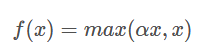

# 【**任务8 -神经网络基础 】时长：2天**

## 1. 基础概念

前馈神经网络、网络层数、输入层、隐藏层、输出层、隐藏单元、激活函数概念

前向神经网络，将输入经过一个线性函数，经过激活函数进行非线性处理

参数相关

网络层数设定与提取特征相关，越大能提取到越复杂的深层次特征

输入层为数据的输入，图像为像素信息输入，语言为单词/字的编码输入

隐藏层用于提取特征的相关信息

输出层用于输出我们设定所需要获得的的标签结果，将数据的输出与标签的形式相对应

隐藏单元是在神经网络中用于提取信息特征的基础单元

激活函数是将纯线性的感知器转化为非线性状态，提高对非线性分类/回归的集合效果

## 2. 感知机相关

利用tensorflow等工具定义简单的几层网络（激活函数sigmoid），递归使用链式法则来实现反向传播。

参考复习之前的吴恩达深度学习：向量前向计算推导和反向梯度下降

采用之前的文本数据做softmax多分类

## 3. 激活函数

种类以及各自的提出背景、优缺点。（和线性模型对比，线性模型的局限性，去线性化）

神经网络中的每个神经元节点接受上一层神经元的输出值作为本神经元的输入值，并将输入值传递给下一层，输入层神经元节点会将输入属性值直接传递给下一层（隐层或输出层）。在多层神经网络中，**上层节点的输出和下层节点的输入之间具有一个函数关系**，这个函数称为激活函数（又称激励函数）

如果不用激励函数（其实相当于激励函数是f(x) = x），在这种情况下你每一层节点的输入都是上层输出的线性函数，很容易验证，无论你神经网络有多少层，输出都是输入的**线性组合（单纯的线性组合）**，与没有隐藏层效果相当，这种情况就是最原始的感知机（Perceptron）了，那么网络的逼近能力就相当有限。正因为上面的原因，我们决定引入非线性函数作为激励函数，这样深层神经网络表达能力就更加强大（不再是输入的线性组合，而是几乎可以逼近任意函数）。

### Sigmoid函数

Sigmoid 是常用的非线性的激活函数，它的数学形式如下：

**特点：**
它能够把输入的连续实值变换为**0和1之间的输出**，特别的，如果是非常大的负数，那么输出就是0；如果是非常大的正数，输出就是1.

**缺点：**
sigmoid函数曾经被使用的很多，不过近年来，用它的人越来越少了。主要是因为它固有的一些 缺点。
缺点1：在深度神经网络中梯度反向传递时导致梯度爆炸和梯度消失，其中梯度爆炸发生的概率非常小，而梯度消失发生的概率比较大。首先来看Sigmoid函数的导数，如下图（sigmoid函数的梯度）所示：

反向梯度计算时，传递一层梯度值都会减小为原来的0.25倍，隐藏层过多会导致**梯度消失**

缺点2：Sigmoid 的 output **不是0均值**（即zero-centered）。这是不可取的，因为这会导致后一层的神经元将得到上一层输出的非0均值的信号作为输入。 产生的一个结果就是：

如x>0, f=wTx+b 

那么对w求局部梯度则都为正，这样在反向传播的过程中w要么都往正方向更新，要么都往负方向更新，导致有一种捆绑的效果，使得收敛缓慢。 当然了，**如果按batch去训练，那么那个batch可能得到不同的信号，所以这个问题还是可以缓解一下的**。因此，非0均值这个问题虽然会产生一些不好的影响，不过跟上面提到的梯度消失问题相比还是要好很多的。

缺点3：其解析式中含有幂运算，计算机求解时相对来讲比较耗时。对于规模比较大的深度网络，这会较大地增加训练时间。

### tanh函数（改进zero-centered）

### Relu函数

Relu函数的解析式：

取最大值函数

优点：

1）解决了gradient vanishing问题 (在正区间)
2）计算速度非常快，只需要判断输入是否大于0
3）收敛速度远快于sigmoid和tanh

ReLU也有几个需要特别注意的问题：
1）ReLU的输出不是zero-centered

2）Dead ReLU Problem，指的是某些神经元可能永远不会被激活，导致相应的参数永远不能被更新。有两个主要原因可能导致这种情况产生: (1) 非常不幸的参数初始化，这种情况比较少见 (2) learning rate太高导致在训练过程中参数更新太大，不幸使网络进入这种状态。解决方法是可以采用Xavier初始化方法，以及避免将learning rate设置太大或使用adagrad等自动调节learning rate的算法。

### Leaky ReLU函数（PReLU）

人们为了解决Dead ReLU Problem，提出了将ReLU的前半段设为αx \alpha xαx而非0，ReLU的所有优点，外加不会有Dead ReLU问题，但是在实际操作当中，并没有完全证明Leaky ReLU总是好于ReLU

改进了输出小于0时的梯度传递问题

\4. 深度学习中的正则化（参数范数惩罚：L1正则化、L2正则化；数据集增强；噪声添加；early stop；Dropout层）、正则化的介绍。

\5. 深度模型中的优化：参数初始化策略；自适应学习率算法（梯度下降、AdaGrad、RMSProp、Adam；优化算法的选择）；batch norm层（提出背景、解决什么问题、层在训练和测试阶段的计算公式）；layer norm层。

## 4. 深度学习中的正则化

（参数范数惩罚：L1正则化、L2正则化；数据集增强；噪声添加；early stop；Dropout层）、正则化的介绍。

正则化的目的：减少过拟合（高方差，防止模型过于复杂）

### 参数范数惩罚

机器学习中几乎都可以看到损失函数后面会添加一个额外项，常用的额外项一般有两种，称作 L1正则化 和 L2正则化，或者 L1范数 和 L2范数，可以看做是损失函数的惩罚项

L1正则化

L2正则化

一般回归分析中回归w ww表示特征的系数，从上式可以看到正则化项是对系数做了处理（限制）。L1正则化和L2正则化的说明如下：

L1正则化是指权值向量w ww中各个元素的绝对值之和，通常表示为||w||_1
	

L2正则化是指权值向量w ww中各个元素的平方和然后再求平方根（可以看到Ridge回归的L2正则化项有平方符号），通常表示为||w||_2

- L1正则化可以产生稀疏权值矩阵，即产生一个稀疏模型，可以用于特征选择

  因为L1正则化趋向于让系数等于零

- L2正则化可以防止模型过拟合（overfitting）；一定程度上，L1也可以防止过拟合

  拟合过程中通常都倾向于让权值尽可能小，最后构造一个所有参数都比较小的模型。因为一般认为参数值小的模型比较简单，能适应不同的数据集，也在一定程度上避免了过拟合现象。可以设想一下对于一个线性回归方程，若参数很大，那么只要数据偏移一点点，就会对结果造成很大的影响；但如果参数足够小，数据偏移得多一点也不会对结果造成什么影响，专业一点的说法是『抗扰动能力强』

## 5. 深度模型中的优化

参数初始化策略；自适应学习率算法（梯度下降、AdaGrad、RMSProp、Adam；优化算法的选择）；batch norm层（提出背景、解决什么问题、层在训练和测试阶段的计算公式）；layer norm层。

### 自适应学习率算法

**梯度下降法(Gradient Descent)**

假设要学习训练的模型参数为WW，代价函数为J(W)J(W)，则代价函数关于模型参数的偏导数即相关梯度为ΔJ(W)ΔJ(W)，学习率为ηtηt，则使用梯度下降法更新参数为：

直接利用梯度学习达到最优解最快的路径

标准梯度下降法主要有两个缺点:

训练速度慢：每走一步都要要计算调整下一步的方向，下山的速度变慢。在应用于大型数据集中，每输入一个样本都要更新一次参数，且每次迭代都要遍历所有的样本。会使得训练过程及其缓慢，需要花费很长时间才能得到收敛解。

容易陷入局部最优解：由于是在有限视距内寻找下山的反向。当陷入平坦的洼地，会误以为到达了山地的最低点，从而不会继续往下走。所谓的局部最优解就是鞍点。落入鞍点，梯度为0，使得模型参数不在继续更新。

改进**批量梯度下降法(BGD)**

假设批量训练样本总数为nn，每次输入和输出的样本分别为X(i),Y(i)X(i),Y(i)，模型参数为WW，代价函数为J(W)J(W)，每输入一个样本ii代价函数关于WW的梯度为ΔJi(Wt,X(i),Y(i))ΔJi(Wt,X(i),Y(i))，学习率为ηtηt，则使用批量梯度下降法更新参数表达式为：

每轮训练样本的数据为m，模型参数的调整更新与全部输入样本的**代价函数的和**（即批量/全局误差）有关。即每次权值调整发生在批量样本输入之后，而不是每输入一个样本就更新一次模型参数。这样就会大大加快训练速度。极大的加快了更新速度

**随机梯度下降法(SGD)**

从一批训练样本nn中随机选取一个样本进行梯度下降的参数更新

主要优势在于引入了随机性和噪声，下降速度慢，方向不一定一直正确

**SGD因为随机性，在其他优化器的loss无法降低时尝试使用SGD**

**动量优化法**

Momentum
使用动量(Momentum)的随机梯度下降法(SGD)，主要思想是引入一个积攒历史梯度信息动量来加速SGD。
从训练集中取一个大小为nn的小批量{X(1),X(2),...,X(n)}{X(1),X(2),...,X(n)}样本，对应的真实值分别为Y(i)Y(i)，则Momentum优化表达式为：

其中，vtvt表示tt时刻积攒的加速度。αα表示动力的大小，一般取值为0.9（表示最大速度10倍于SGD）。ΔJ(Wt,X(is),Y(is))ΔJ(Wt,X(is),Y(is))含义见SGD算法。WtWt表示tt时刻模型参数。
动量主要解决SGD的两个问题：一是随机梯度的方法（引入的噪声）；二是Hessian矩阵病态问题（可以理解为SGD在收敛过程中和正确梯度相比来回摆动比较大的问题）。

**理解策略为：由于当前权值的改变会受到上一次权值改变的影响，类似于小球向下滚动的时候带上了惯性。这样可以加快小球向下滚动的速度。**

引入了加速度，收到前一步权值更新的影响

**AdaGrad算法**

AdaGrad算法，独立地适应所有模型参数的学习率，缩放每个参数反比于其所有梯度历史平均值总和的平方根。具有代价函数最大梯度的参数相应地有个快速下降的学习率，而具有小梯度的参数在学习率上有相对较小的下降。

AdaGrad算法优化策略一般可以表示为：

对出现比较多的类别数据，Adagrad给予越来越小的学习率，而对于比较少的类别数据，会给予较大的学习率。因此Adagrad适用于数据稀疏或者分布不平衡的数据集

**RMSProp算法**

RMSProp算法修改了AdaGrad的梯度积累为指数加权的移动平均，使得其在非凸设定下效果更好。

WtWt表示tt时刻即第tt迭代模型的参数，gt=ΔJ(Wt)gt=ΔJ(Wt)表示tt次迭代代价函数关于WW的梯度大小，E[g2]tE[g2]t表示前tt次的梯度平方的均值。αα表示动力（通常设置为0.9），η0η0表示全局初始学习率。ϵϵ是一个取值很小的数（一般为1e-8）为了避免分母为0。

RMSProp借鉴了Adagrad的思想，观察表达式，分母为E[g2]t+ϵ−−−−−−−−√E[g2]t+ϵ。由于取了个加权平均，避免了学习率越来越低的的问题，而且能自适应地调节学习率。

RMSProp算法在经验上已经被证明是一种有效且实用的深度神经网络优化算法。目前它是深度学习从业者经常采用的优化方法之一。

 **AdaDelta算法**

思想：AdaGrad算法和RMSProp算法都需要指定全局学习率，AdaDelta算法结合两种算法每次参数的更新步长

AdaDelta算法策略可以表示为:

WtWt为第tt次迭代的模型参数，gt=ΔJ(Wt)gt=ΔJ(Wt)为代价函数关于WW的梯度。E[g2]tE[g2]t表示前tt次的梯度平方的均值。∑t−1i=1ΔWi∑i=1t−1ΔWi表示前t−1t−1次模型参数每次的更新步长累加求根。

从表达式可以看出，AdaDelta不需要设置一个默认的全局学习率。

评价：

- 在模型训练的初期和中期，AdaDelta表现很好，加速效果不错，训练速度快。
- 在模型训练的后期，模型会反复地在局部最小值附近抖动

**Adam算法**

首先，Adam中动量直接并入了梯度一阶矩（指数加权）的估计。其次，相比于缺少修正因子导致二阶矩估计可能在训练初期具有很高偏置的RMSProp，Adam包括偏置修正，修正从原点初始化的一阶矩（动量项）和（非中心的）二阶矩估计

其中，mtmt和vtvt分别为一阶动量项和二阶动量项。β1,β2β1,β2为动力值大小通常分别取0.9和0.999；m^t,v^tm^t,v^t分别为各自的修正值。WtWt表示tt时刻即第tt迭代模型的参数，gt=ΔJ(Wt)gt=ΔJ(Wt)表示tt次迭代代价函数关于WW的梯度大小；ϵϵ是一个取值很小的数（一般为1e-8）为了避免分母为0

### batch norm层

（提出背景、解决什么问题、层在训练和测试阶段的计算公式）

深度网络会需要batchnorm batchnormbatchnorm的原因：

* 深度学习的话尤其是在CV上都需要对数据做归一化，因为深度神经网络主要就是为了学习训练数据的分布，并在测试集上达到很好的泛化效果，但是，如果我们每一个batch输入的数据都具有不同的分布，显然会给网络的训练带来困难。

* Internal Covariate Shift其主要描述的是：训练深度网络的时候经常发生训练困难的问题，因为，每一次参数迭代更新后，上一层网络的输出数据经过这一层网络计算后，数据的分布会发生变化，为下一层网络的学习带来困难（神经网络本来就是要学习数据的分布，要是分布一直在变，学习就很难了），此现象称之为Internal Covariate Shift
* covariate shift训练数据和测试数据存在分布的差异性，给网络的泛化性和训练速度带来了影响，我们经常使用的方法是做归一化或者白化

使用：为了减小Internal InternalInternal Covariate CovariateCovariate Shift ShiftShift，对神经网络的每一层做归一化不就可以了，假设将每一层输出后的数据都归一化到0均值，1方差，满足正太分布，但是，此时有一个问题，每一层的数据分布都是标准正太分布，导致其完全学习不到输入数据的特征，因为，费劲心思学习到的特征分布被归一化了，因此，直接对每一层做归一化显然是不合理的。

但是如果稍作修改，加入可训练的参数做归一化，那就是BatchNorm BatchNormBatchNorm实现的了，接下来结合下图的伪代码做详细的分析：

 

**Batchnorm的优点**
主要部分说完了，接下来对BatchNorm做一个总结：

没有它之前，需要小心的调整学习率和权重初始化，但是有了BN可以放心的使用大学习率，但是使用了BN，就不用小心的调参了，较大的学习率极大的提高了学习速度，
Batchnorm本身上也是一种正则的方式，可以代替其他正则方式如dropout等

另外，个人认为，batchnorm降低了数据之间的绝对差异，有一个去相关的性质，更多的考虑相对差异性，因此在分类任务上具有更好的效果。

往期优秀作业学习

1.木 ：[https://blog.csdn.net/SMith7](https://blog.csdn.net/SMith7412/article/details/88396674)[41](https://blog.csdn.net/SMith7412/article/details/88396674)[2/article/](https://blog.csdn.net/SMith7412/article/details/88396674)[detail](https://blog.csdn.net/SMith7412/article/details/88396674)[s/88396674](https://blog.csdn.net/SMith7412/article/details/88396674)

2.ckh ：

[htt](https://blog.csdn.net/chen_yiwei/article/details/88396881)[ps](https://blog.csdn.net/chen_yiwei/article/details/88396881)[:](https://blog.csdn.net/chen_yiwei/article/details/88396881)[/](https://blog.csdn.net/chen_yiwei/article/details/88396881)[/b](https://blog.csdn.net/chen_yiwei/article/details/88396881)[log.csd](https://blog.csdn.net/chen_yiwei/article/details/88396881)[n.net/chen_yiwei/article/details/88396881](https://blog.csdn.net/chen_yiwei/article/details/88396881)

[https://blog](https://blog.csdn.net/chen_yiwei/article/details/88407587)[.cs](https://blog.csdn.net/chen_yiwei/article/details/88407587)[dn.](https://blog.csdn.net/chen_yiwei/article/details/88407587)[n](https://blog.csdn.net/chen_yiwei/article/details/88407587)[et/chen_yiwei/article/details/88407587](https://blog.csdn.net/chen_yiwei/article/details/88407587)

[https://blog.cs](https://blog.csdn.net/chen_yiwei/article/details/88397719)[d](https://blog.csdn.net/chen_yiwei/article/details/88397719)[n.n](https://blog.csdn.net/chen_yiwei/article/details/88397719)[e](https://blog.csdn.net/chen_yiwei/article/details/88397719)[t](https://blog.csdn.net/chen_yiwei/article/details/88397719)[/c](https://blog.csdn.net/chen_yiwei/article/details/88397719)[hen_yiwei/article/details/88397](https://blog.csdn.net/chen_yiwei/article/details/88397719)[719](https://blog.csdn.net/chen_yiwei/article/details/88397719)

3.流量的星星 ：

[http://note.youdao.c](http://note.youdao.com/noteshare?id=5b0c0a73e0da874c3e541f3b5899854e&sub=EE3DC1464F5A46F0B457772561044499)[om/n](http://note.youdao.com/noteshare?id=5b0c0a73e0da874c3e541f3b5899854e&sub=EE3DC1464F5A46F0B457772561044499)[oteshare?id=5b0c](http://note.youdao.com/noteshare?id=5b0c0a73e0da874c3e541f3b5899854e&sub=EE3DC1464F5A46F0B457772561044499)[0](http://note.youdao.com/noteshare?id=5b0c0a73e0da874c3e541f3b5899854e&sub=EE3DC1464F5A46F0B457772561044499)[a73e0da874c3e541f3b5899854e&sub=EE3DC](http://note.youdao.com/noteshare?id=5b0c0a73e0da874c3e541f3b5899854e&sub=EE3DC1464F5A46F0B457772561044499)[146](http://note.youdao.com/noteshare?id=5b0c0a73e0da874c3e541f3b5899854e&sub=EE3DC1464F5A46F0B457772561044499)[4](http://note.youdao.com/noteshare?id=5b0c0a73e0da874c3e541f3b5899854e&sub=EE3DC1464F5A46F0B457772561044499)[F5A](http://note.youdao.com/noteshare?id=5b0c0a73e0da874c3e541f3b5899854e&sub=EE3DC1464F5A46F0B457772561044499)[46](http://note.youdao.com/noteshare?id=5b0c0a73e0da874c3e541f3b5899854e&sub=EE3DC1464F5A46F0B457772561044499)[F0](http://note.youdao.com/noteshare?id=5b0c0a73e0da874c3e541f3b5899854e&sub=EE3DC1464F5A46F0B457772561044499)[B4](http://note.youdao.com/noteshare?id=5b0c0a73e0da874c3e541f3b5899854e&sub=EE3DC1464F5A46F0B457772561044499)[577725610](http://note.youdao.com/noteshare?id=5b0c0a73e0da874c3e541f3b5899854e&sub=EE3DC1464F5A46F0B457772561044499)[44](http://note.youdao.com/noteshare?id=5b0c0a73e0da874c3e541f3b5899854e&sub=EE3DC1464F5A46F0B457772561044499)[49](http://note.youdao.com/noteshare?id=5b0c0a73e0da874c3e541f3b5899854e&sub=EE3DC1464F5A46F0B457772561044499)[9](http://note.youdao.com/noteshare?id=5b0c0a73e0da874c3e541f3b5899854e&sub=EE3DC1464F5A46F0B457772561044499)

\4. Juanting Xu:

[htt](https://blog.csdn.net/qq_36047533/article/details/88419931)[p](https://blog.csdn.net/qq_36047533/article/details/88419931)[s](https://blog.csdn.net/qq_36047533/article/details/88419931)[:](https://blog.csdn.net/qq_36047533/article/details/88419931)[//blog.](https://blog.csdn.net/qq_36047533/article/details/88419931)[csd](https://blog.csdn.net/qq_36047533/article/details/88419931)[n](https://blog.csdn.net/qq_36047533/article/details/88419931)[.net/qq_36047533/a](https://blog.csdn.net/qq_36047533/article/details/88419931)[rti](https://blog.csdn.net/qq_36047533/article/details/88419931)[cle](https://blog.csdn.net/qq_36047533/article/details/88419931)[/](https://blog.csdn.net/qq_36047533/article/details/88419931)[det](https://blog.csdn.net/qq_36047533/article/details/88419931)[ails/88419](https://blog.csdn.net/qq_36047533/article/details/88419931)[931](https://blog.csdn.net/qq_36047533/article/details/88419931)