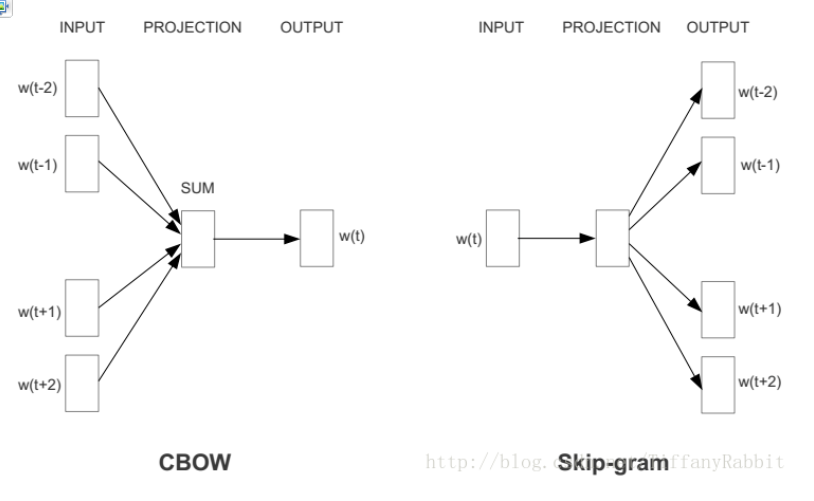

# 【**任务9 -简单神经网络 】时长：2天**

## 1. 文本表示

从one-hot到word2vec。

词向量是用来进行文本表示的

### one-hot编码

又称独热编码、一位有效编码。其方法是使用N位状态寄存器来对N个状态进行编码，每个状态都有它独立的寄存器位，并且在任意时候，其中只有一位有效

词向量最初是用**one-hot represention**表征的，也就是向量中每一个元素都关联着词库中的一个单词，指定词的向量表示为：**其在向量中对应的元素设置为1，其他的元素设置为0。**采用这种表示无法对词向量做比较，后来就出现了分布式表征。

one hot在特征提取上属于词袋模型（bag of words）

word2vec中就是采用分布式表征，在向量维数比较大的情况下，每一个词都可以用元素的分布式权重来表示，因此，向量的每一维都表示一个特征向量，作用于所有的单词，而不是简单的元素和值之间的一一映射。这种方式抽象的表示了一个词的“意义”。 
向量的长度为词典的大小，向量的分量只有一个 1，其他全为 0， 1 的位置对应该词在词典中的位置，例如

“话筒”表示为 [0 0 0 1 0 0 0 0 0 0 0 0 0 0 0 0 …]

“麦克”表示为 [0 0 0 0 0 0 0 0 1 0 0 0 0 0 0 0 …]

优点： 如果使用稀疏方式存储，非常简洁，实现时就可以用0,1,2,3,…来表示词语进行计算，这样“话筒”就为3，“麦克”为8.

缺点：

1.容易受维数灾难的困扰，尤其是将其用于 Deep Learning 的一些算法时；

2.任何两个词都是孤立的，存在语义鸿沟词（任意两个词之间都是孤立的，不能体现词和词之间的关系）。

优点：**解决“词汇鸿沟”问题**

缺点：训练有难度。没有直接的模型可训练得到。所以采用通过训练语言模型的同时，得到词向量 

word2vec是其中一种。值得注意的是，**每个词在不同的语料库和不同的训练方法下，得到的词向量可能是不一样的**，其是一种获得词向量的方法

**N-gram**
N-gram就是最简单的一种语言模型。在一些NLP任务中，我们需要判断一句话出现的概率是多少，即这句话是不是符合人的说话习惯，这时就可以利用到N-gram。另外，N-gram可以用于实现汉字转换，关于这点，读者可以查询资料。

N-gram的数学模型非常简单，就是一条数学表达式：

p(s)=p(w1,w2,⋯wT)=p(w1)p(w2|w1)p(w3|w1,w2)⋯p(wt|w1,w2,⋯wT−1)
p(s)=p(w1,w2,⋯wT)=p(w1)p(w2|w1)p(w3|w1,w2)⋯p(wt|w1,w2,⋯wT−1)

上面概率公式的意义为：第一次词确定后，看后面的词在前面次出现的情况下出现的概率。

### word2vec

常用的word2vec模型是：CBOW，Skip-gram。框架图如下： 

CBOW通过上下文预测中心词概率，而Skip-gram模型则通过中心词预测上下文的概率

**举个例子，对于一句话：社会主义就是好，对于CBOW，如果要预测“主义”，则输入就是“社会”，“就是”，“好”；对于Skip-gram，输入则是“主义”，输出是剩下的几个字。**

但它们的相同点在于，这两个算法训练的目标都是最大限度的观察实际输出词（焦点词）在给定输入上下文且考虑权重的条件概率。比如在上段的例子里，通过输入“社会”，“就是”，“好”之后，算法的目标就是训练出一个网络，在输出层，能最大概率的得到“主义”的条件概率。

CBOW一下网络架构

符号定义： 语料库为D，词汇总数V；考虑上下文词语数C个，分别表示为 w1k,w2k,...,wCkw1k,w2k,...,wCk ；映射层/词向量维度为N；xwxw 为词汇w的One-hot Representation，V维；xwxw 为词汇w的词向量，N维。 
输入层： 输入层的节点为C个上下文词语的one-hot表示，共C*V输入节点。 

映射层： 将输入层节点乘上权重矩阵 WV∗NWV∗N 得到的词向量（word embedding）求平均得到h。公式如下。

输出层： 映射层经过 W'N∗VW′N∗V(而后即为UN∗VUN∗V) 权重矩阵后，得到V维z， 再对z进行softmax操作得到中心词为某个词j的概率分布。公式如下。 

这个神经网络，除了训练出了一个语言模型，更为重要的是得到了源输入的词向量表示，那就是权重矩阵WV∗NWV∗N。

如何理解？举个例子就知道了。如果输入是100001的one-hot向量，而隐含层神经元是300，则可见，权重矩阵（输入层-隐含层）为10000*300。而这时，权重矩阵的每一行就是一个词的词向量。为什么？我们来看看这个乘法： 

假设等号最左边是输入，然后乘以权重矩阵，可见输出就是权重矩阵在对应输入向量元素值为1的索引的行。因此，得到的权重矩阵的每一行都是词向量。

1.1 词袋模型：离散、高维、稀疏。

假如现在有1000篇新闻文档，把这些文档拆成一个个的字，去重后得到3000个字，然后把这3000个字作为字典，进行文本表示的模型，叫做词袋模型。这种模型的特点是字典中的字没有特定的顺序，句子的总体结构也被舍弃了。下面分别介绍词袋模型中的one-hot、TF-IDF和n-gram文本表示方法。

离散：无法衡量词向量之间的关系
    比如酒店、宾馆、旅社 三者都只在某一个固定的位置为 1 ，所以找不到三者的关系，各种度量(与或非、距离)都不合适，即太稀疏，很难捕捉到文本的含义。
高维：词表维度随着语料库增长膨胀，n-gram 序列随语料库膨胀更快。

数据稀疏： 数据都没有特征多，数据有 100 条，特征有 1000 

1.2 分布式表示：连续、低维、稠密。

## word2vec词向量原理并实践，用来表示文本。

https://github.com/watchtree/Recommend/blob/master/2_%E5%8F%AC%E5%9B%9E%E7%AE%97%E6%B3%95_1203/word2vec.ipynb

